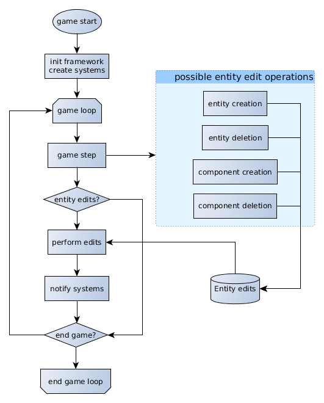
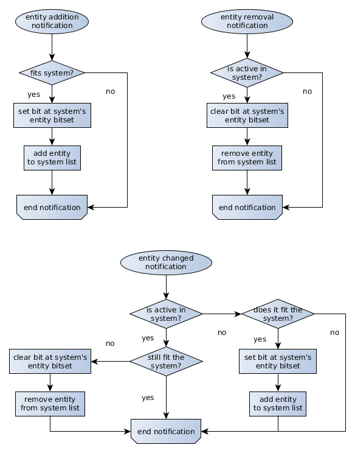
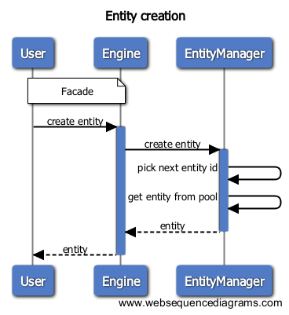
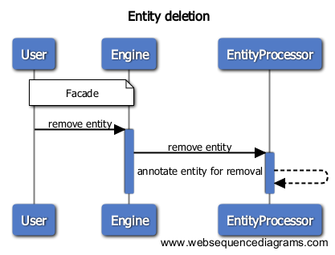
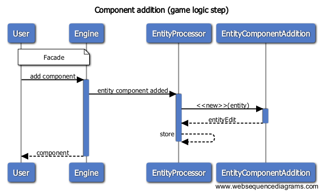
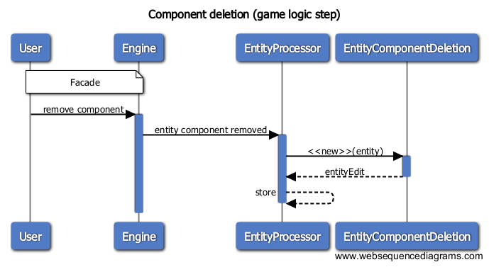

# secs specs

## Table of Contents

0. [Disclaimer](#0-disclaimer)
2. [Entity Component Systems](#2-entity-component-systems)
3. [Goals](#3-goals)
4. [Non-goals](#4-non-goals)
5. [Framework detail](#5-framework-detail)
  1. [Life cycle](#5-1-life-cycle)
  2. [System notification](#5-2-system-notification)
  3. [Entity operations](#5-3-entity-operations)

---

## 1. Disclaimer

**This document is in alpha stage and will constantly evolve during development.** The software used for the creation of the diagrams are **yEd** and **websequencediagrams.com**.

## 2. Entity Component Systems

#### What is an ECS?

I am not going to explain ECS in detail, but just mention each essential part for completeness.

* **Entity**. Every interactive element in a game can be an entity (i.e.: spikes, player, bullet, zombie pig).
* **Components**. Data belonging an entity (i.e.: health, color, animation, stats, weapon).
* **System**. Performs logic over components (i.e.: movement, shooting, dying, rendering, physics).

#### Why another one?

Well, there are a lot of ECS out there like ashley and artemis for java, and entityx for C++. Why to create a new one then? I've been somehow obsessed with this approach of handling logic in a game, but most of the time was wasted on studying others, reading and making experimental implementations, sometimes even using them in actual games. Because of this, I would like to take a more serious project and make one for C++, just for fun.

## 3. Goals

* **Usability** in real games.
* **Comprehensive design**.
* **Simplicity**, but not simpler than needed.
* Good **compromise** between last two points.

## 4. Non-goals

* **Fast**. Speed won't be a target. There is EntityX which is a fast framework.
* **Generality**. Meaning that the design will provide simple functionality without trying to cover all possible cases. An example of a very generic framework is artemis-odb, where a lot of use cases for types of systems (for example) are provided.

## 5. Framework detail

Note that I will use framework instead of system when referring to the ECS framework in order to avoid confusion between the ECS and the systems that process game logic within the framework.

### 5.1. Life cycle

The framework will need the systems to be created and inserted at start. Then, in the game loop, these systems will perform the game logic.

Some entity related operations can be requested inside it. These operations won't be performed right away, but instead the framework will wait for all the systems to end, and then, perform all entity operations and notify systems when applicable.

### 5.2. System notification

Systems will have a bitset to keep track of which entities are present in it, and which not. Also, each system will have of the processed entities. Systems will be notified about the following operations:

* Entity addition: if the system accepts the entity, the system will mark it as active in the entity bitset, and add it to the processing list.

* Entity removal: the system will check if the entity is marked as active, and mark it as inactive if so. If it was active, it should also

* Entity changed: if the entity was already in the system, the system checks if still fits. If the entity does not fit the system, the system removes it. If the entity was not present in the system, the system checks if the entity fits the system. If so, the system adds the entity to its active entity list.

The following flowchart resembles this logic:

### 5.3. Entity operations

So the available entity operations are the following:

* Create an entity
* Delete an entity
* Add component to an entity
* Remove component from an entity

During the game step, entity operations will be annotated but not performed, since it's safer to delay all entity operations after every system performed its step, avoiding possible bugs depending on the order in which systems are run. Also, if we delay all entity component operations, we have to notify all systems just once, instead of once per component added.

An example to illustrate this is a shooting system which purpose is to spawn bullets. This system would trigger bullet spawn when a entity sets a flag `wantShoot` in an hypothetical `ShootComponent`. The bullet entity will be created, but components won't be added until the end of the game loop where the bullet is spawn, so it will be like if the bullet didn't even exist.

#### Entity creation

#### Entity deletion

#### Component addition to entity

#### Component deletion from entity

#### Entity processor
