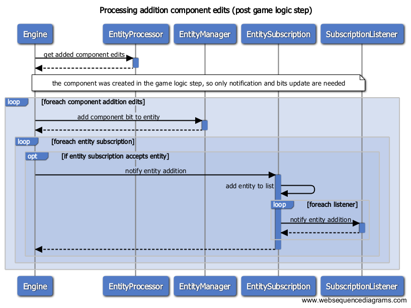
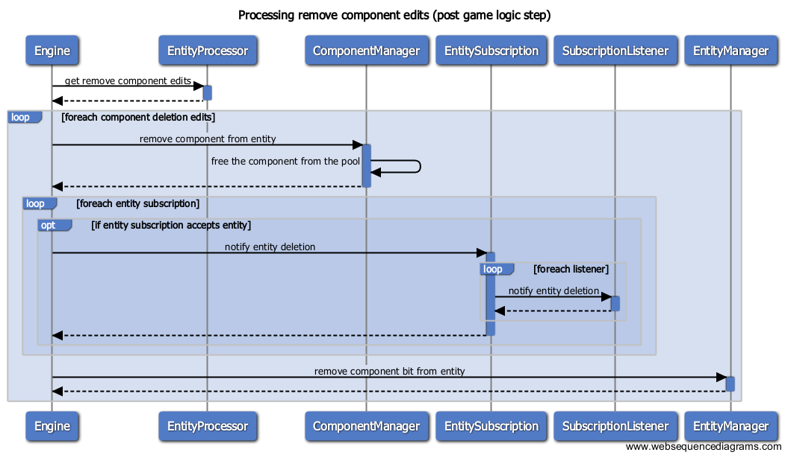

# secs specs

## Table of Contents

0. [Disclaimer](#0-disclaimer)
2. [Entity Component Systems](#2-entity-component-systems)
3. [Goals](#3-goals)
4. [Non-goals](#4-non-goals)
5. [Framework detail](#5-framework-detail)
  1. [Life cycle](#5-1-life-cycle)
  2. [Entity operations](#5-2-entity-operations)

---

## 1. Disclaimer

**This document is in alpha stage and will constantly evolve during development.** The software used for the creation of the diagrams are **yEd** and **websequencediagrams.com**.

## 2. Entity Component Systems

#### What is an ECS?

I am not going to explain ECS in detail, but just mention each essential part for completeness.

* **Entity**. Every interactive element in a game can be an entity (i.e.: spikes, player, bullet, zombie pig).
* **Components**. Data belonging an entity (i.e.: health, color, animation, stats, weapon).
* **System**. Performs logic over components (i.e.: movement, shooting, dying, rendering, physics).

#### Why another one?

Well, there are a lot of ECS out there like ashley and artemis for java, and entityx for C++. Why to create a new one then? I've been somehow obsessed with this approach of handling logic in a game, but most of the time was wasted on studying others, reading and making experimental implementations, sometimes even using them in actual games. Because of this, I would like to take a more serious project and make one for C++, just for fun.

## 3. Goals

* **Usability** in real games.
* **Comprehensive design**.
* **Simplicity**, but not simpler than needed.
* Good **compromise** between last two points.

## 4. Non-goals

* **Fast**. Speed won't be a target. There is EntityX which is a fast framework.
* **Generality**. Meaning that the design will provide simple functionality without trying to cover all possible cases. An example of a very generic framework is artemis-odb, where a lot of use cases for types of systems (for example) are provided.

## 5. Framework detail

Note that I will use framework instead of system when referring to the ECS framework in order to avoid confusion between the ECS and the systems that process game logic within the framework.

### 5.1. Life cycle

The framework will need the systems to be created and inserted at start. Then, in the game loop, these systems will perform the game logic. Some entity related operations can be requested inside it.

### 5.2. Entity operations

So the available entity operations are the following:

* Create an entity
* Delete an entity
* Add component to an entity
* Remove component from an entity

#### Entity creation

#### Entity deletion

#### Component addition to entity

#### Component deletion from entity

